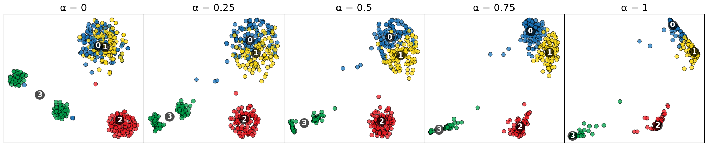
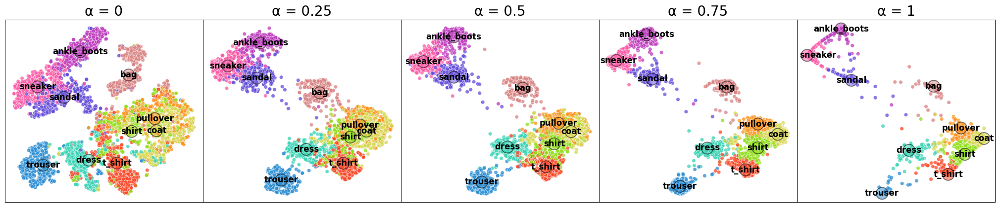

# class-constrained t-SNE
Codes for the dimensionality reduction-based method named class-constrained t-SNE which enables the combination and comparison of data feature structure and class probability structure.
||
|:--:| 
| *projection results of a synthetic dataset* |

||
|:--:| 
| *projection results of the fashion MNIST dataset* |
## Usage
### How to run examples
python and conda is installed
```
cd examples
conda create --prefix ./envs python=3.8 notebook matplotlib numpy pandas seaborn
conda activate ./envs
jupyter notebook

```
### How to use the method in your project
The algorithm is implemented using C++. We use pybind11 to compile the codes and generate .pyd file for use in python environment. The C++ codes can be found in `src` folder. You can copy the cstsne folder in the example folder to your own python project and then import and use it as shown in the example.

## Acknowledgments
Our code is build upon [HDI](https://github.com/Nicola17/High-Dimensional-Inspector).

